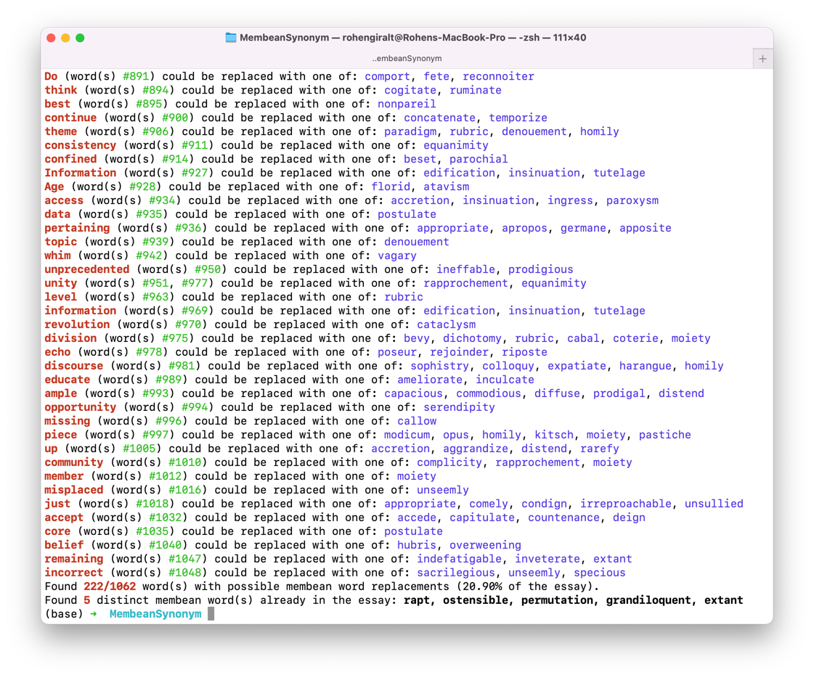

# Membean Synonym Finder

A simple tool to find possible membean word replacements in essays. 
It scans each word in the essay, and provides a list of possible membean word synonyms for each one.
Keep in mind that there are many false positives: many words have multiple meanings—if you blindly follow all the suggestions of this tool without actually knowing what the words mean, you will lose points.
And you will probably deserve it.
## Dependencies
You **must** have python installed in order to run this project. See https://www.python.org/downloads/ for more information.

Beyond that, this project uses two dependencies:
- `termcolor`, to print out nice looking outputs, and
- `pyperclip`, to allow easy input from the clipboard (without this, it's sometimes difficult to paste in a large essay).

However, neither of these dependencies are strictly required, so the following steps may be skipped (albeit with reduced functionality).
### Windows
Replace `path/to/project` with whatever the file path of the `MembeanSynonym` directory is on your device.
```shell
cd path/to/project
python -m pip install -r requirements.txt
```
### macOS
Replace `path/to/project` with whatever the file path of the `MembeanSynonym` directory is on your device.
```shell
cd path/to/project
python3 -m pip install -r requirements.txt
```
### Linux/Whatever else
You know how to install a `requirements.txt`.
## Usage
To use this tool, run the following:

Note: Replace `path/to/project` with whatever the file path of the `MembeanSynonym` directory is on your device. On macOS, replace all usages of `python` with `python3`.
```shell
cd path/to/project
python main.py
```
### Input
If `pyperclip` is installed, you'll be first prompted for an input mode:
```
How do you want to input your essay (type 'c' to get it from your clipboard; type 'm' to type/paste it in manually)
```
Selecting `m` will allow you to manually input the text to be analyzed. 
Selecting `c` will automatically input whatever has been copied to the clipboard using Ctrl+C (Cmd+C on macOS). 
### Membean Level Selection
This tool can be configured to only use membean words of a specific level or levels. 
To do so, respond with a comma separated list (such as `3, 4, 5`) when prompted:  
```
Which membean levels would you like to include? Enter a comma separated list, or press enter to include words from all levels.
```